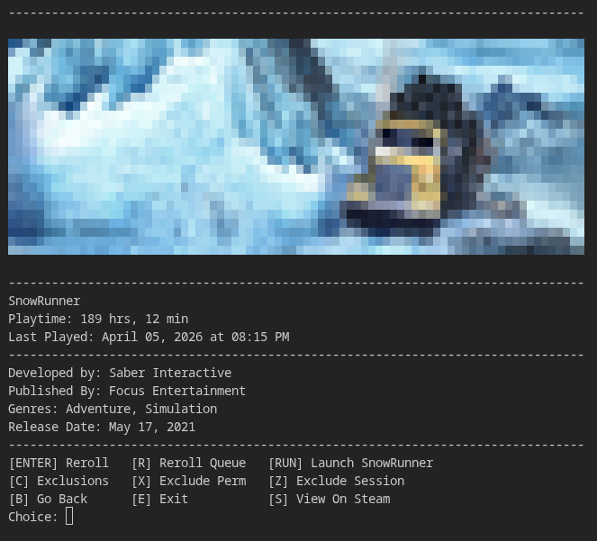

# Steam Game Randomizer
Welcome to the creatively named Steam Game Randomizer, or SGR for short.

## Features
  * Shows a random game from your steam library - reroll as many times as you want
  * Run the game directly from the randomizer instead of opening your steam library and finding the game
  * Exclude games from being shown to you
    
## Why use this over something like the steamDB game randomizer?
  * Allows you to pull your game list from the API even with your account being private (if you use the api key assigned to the user id you are using)
  * Faster rerolling
  * Run the game faster, instead of opening your steam library and finding the game
  * Exclude unwanted games from showing up in the randomizer
  * Runs locally
## Prerequisites
  * Python 3.12 or higher
  * climage
  * requests
  * (follow setup guide for install)
## Setup
   * Clone the repository: ```git clone https://github.com/blu2ns/SGR-steam-game-randomizer.git ```
     
   * Make sure python & pip are installed.
      * Windows: ```winget install Python.Python.3```
      * Arch Linux: ```sudo pacman -S python python-pip```
      * Ubuntu/Debian Linux: ```sudo apt install python3 python3-pip```
        
   * Install dependencies with ```cd path/to/SGR-steam-game-randomizer``` then ``` pip install -r requirements.txt ``` (for some linux distros you might need to add ```--break-system-packages```)
     
   * Run the program, it will automatically prompt you to create the necessary files it needs. On windows I believe you must run it through the terminal.
      * Windows: ```python path/to/steam_game_randomizer.py```
      * Linux: ```python3 path/to/steam_game_randomizer.py```
     
   * The program will prompt you to input an API key and User ID. Input them when requested. Follow the instructions below if you need help with the API Key or User ID.
       
     * How to find your user ID:
        * Open steam desktop app, website or mobile app.
        * Click on your profile picture in the top right.
        * Click account details.
        * At the top left of the page, under the (usernames)'s account text, your user ID will be shown there.
          
     * How to set up an API key:
        * Read the [steam api terms](https://steamcommunity.com/dev/apiterms) if you wish.
        * Go to [the api key registration page](https://steamcommunity.com/dev/apikey), and make sure you're logged in.
        * For this application, put in 'localhost' into the field.
        * Agree to the terms and press register.
        * Copy the key. Keep this key private.
          
     When you have those credentials, paste them into the program when it asks.

  * Once that has been completed, the program should be ready to run! Follow the onscreen prompts when using it.
  
  * The first time the program is run, make sure to input Y when it asks to refresh the game list. I also recommend having the program get each game's image when it prompts you as well.
    
  For linux users: I recommend creating a .desktop entry with the path to the script, it makes it easier to find and run. For windows users: I recommend switching to linux. 
